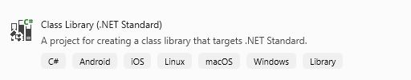
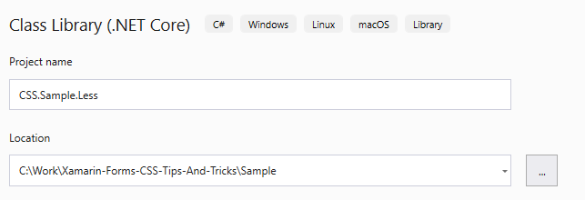
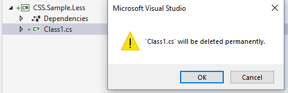
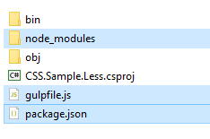

# All about adding Less to your Xamarin.Forms app

## Where Should I add LESS files?
It's depends on your development team culture. It could be separate .Net Standard Library or `Styles` folder in your forms project. In most projects we are using separate .Net Standard Library with **Less** ending. But for sample solution I've put it into `Styles` folder.

## How could I start using LESS?

You need some LESS to CSS compiler. There are a lot of them, but I propose to use `GULP` because it's easy, really flexible, rules are defined by code and it's ready to use in **Visual Studio** and **VS Code**.

## How to start using Gulp?

At first we need init npm packages. For that:
* Open root folder of your project in console
* Type `npm init`
* Fill or leave empty fields with details about your package. 
* Open created `package.json` file
* Add `devDependencies` for:
    * **gulp** - to run gulp tasks
    * **gulp-watch** - to watch `Less` files about any changes(_not required_)
    * **gulp-less** - to compile `Less` files to `CSS`
```json
  "devDependencies": {
    "gulp": "^3.9.1",
    "gulp-watch": "^5.0.1",
    "gulp-less": "^3.3.0"
  }
```
* Save file and get back to console again
* Type `npm install`

Now we could start using `Gulp` to compile `Less`. For that:

* At root folder of your project create `gulpfile.js` file.

_**⚠️ It's not required to create in root folder of your project, you could also create it at `Styles` or any other folder, but Visual Studio Task Runner will not find your gulp tasks then 🐛**_

* Import `gulp` and `gulp-less`:
```js
var gulp = require("gulp"),
    less = require("gulp-less");
```
* Create build task :
```js
gulp.task('less', function () {
    return gulp.src(['./Styles/!Colors.less', './Styles/*.less'])
        .pipe(less())
        .pipe(gulp.dest('./Styles/css'));
});
```
✨ Here we show where look for `Less` files.

✨ `*.less` will take all `Less` files

✨ except `!Colors.less` file, we don't want to compile it to `CSS`

✨ and put compiled `CSS` files into `./Styles/cs` folder

❓ if you want you could specify name of each file:
```js
var styles = [
    'CardPage',
    'Components',
    'TextDecoratorsPage'
];

styles.forEach(function (style) {
    gulp.task(style, function () {
        return gulp.src('./Styles/' + style + '.less')
            .pipe(less())
            .pipe(gulp.dest('./Styles/css'));
    });
});
```
* Subscribe for changes in `Less`:
```js
gulp.task('watch', function () {
    gulp.watch('./Styles/*.less', ['less']);
});
```
✨ If we watch that files, after each saving any of that files it automatically run `less` task

⚠️ If it was saved with compilation error than we will have exception at task output:
```
Potentially unhandled rejection [2] Unrecognised input in file C:\Work\Xamarin-Forms-CSS-Tips-And-Tricks\Sample\CSS.Sample\CSS.Sample\Styles\CardPage.less line no. 18
```
After it we should kill that task and run again, because it will not looking for any changes in files anymore

* Setup Default task:
```js
gulp.task('default', ['less', 'watch']);
```
✔️ Now your project can use `Less` files 

## How to compile Less files to CSS after each time it's saved?

It was described in previous question. In brief:
* Add to your `devDependencies` reference to gulp watch: `"gulp-watch": "^5.0.1",`
* Make subscriptions to some files and after each time they are saved run tasks that you need:
```js
gulp.task('watch', function () {
    gulp.watch('./Styles/*.less', ['array', 'of', 'tasks','to','build','less']);
});
```
* If you want to have if with some other tasks you can put to `default`:
```js
gulp.task('default', ['less', 'watch']);
```
Now it will run as `default` the `less` task and after it your `watch` task that will be looking for changes in `Less` files

## Can we move gulpfile to separate project but Less file left in Forms project?

Sure, we easy can do that. We need only few steps to migrate `gulpfile`:
* Create new Class Library, .Net Standard Class Library



* Set name, best option I think will be `"{Your App Name}.Less"`



* Remove default `Class1.cs` file



* Move `node_modules`; `gulpfile.js` and `package.json` to your new project:



⚠️ **_Good option here is after moving exclude `node_modules` from project, it will not crash anything but speedup performance of Visual Studio_**

* Update path to `Styles` folder:
```js
var gulp = require("gulp"),
    less = require("gulp-less");
var styleFolderPath = "../CSS.Sample/CSS.Sample/Styles/";

gulp.task('less', function () {
    return gulp.src([styleFolderPath + '!Colors.less', styleFolderPath + '*.less'])
        .pipe(less())
        .pipe(gulp.dest(styleFolderPath + 'css'));
});

gulp.task('watch', function () {
    gulp.watch(styleFolderPath + '*.less', ['less']);
});

gulp.task('default', ['less', 'watch']);
```
✨ Here we provide `styleFolderPath` variable to reduce nesting changes if in future path will change and make tasks more readable 

✔️ Now you can focus on your Forms project without any trash files inside and look into `Less` project only if you need to change gulp tasks.